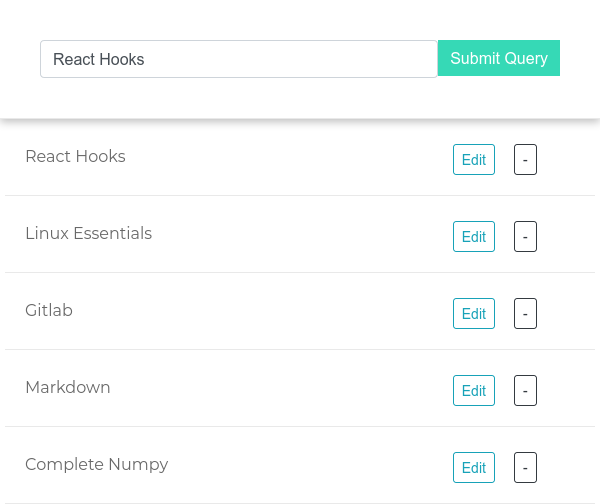
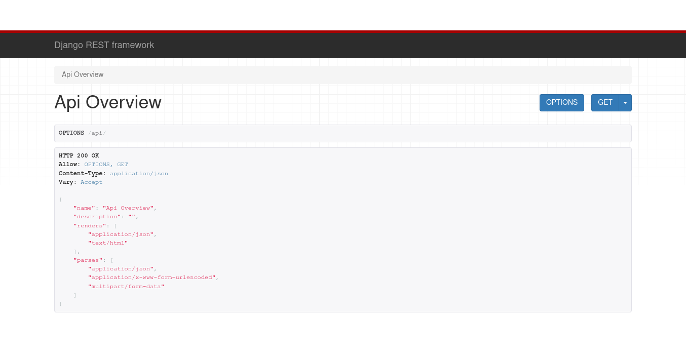
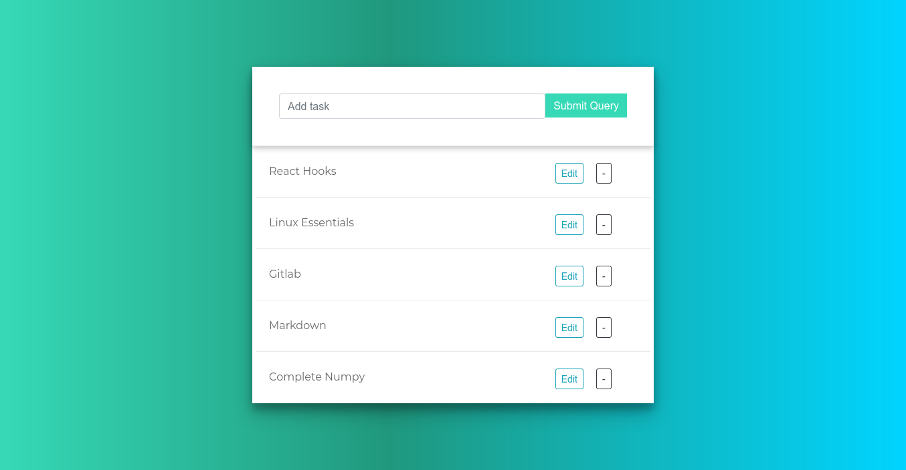

# Todo Using Django-Restframework (todo_drf)

***

## CRUD using Django

***CRUD stands for Create, Read, Update, and Delete, which are four primitive database operations. At first glance, these operations map well to the HTTP verbs most frequently used in REST: Create (SQL INSERT) : POST - Used to support the creation of a child resource, but can also modify the underlying state of a system.***

*In this repository, I have implemented CRUD functionality using Django REST API

***

# Few Images from the Box

## Image-1

---

## Image-2

***

## Image-3

